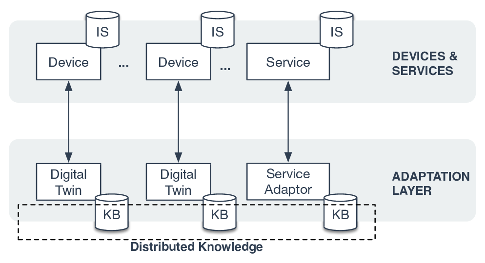
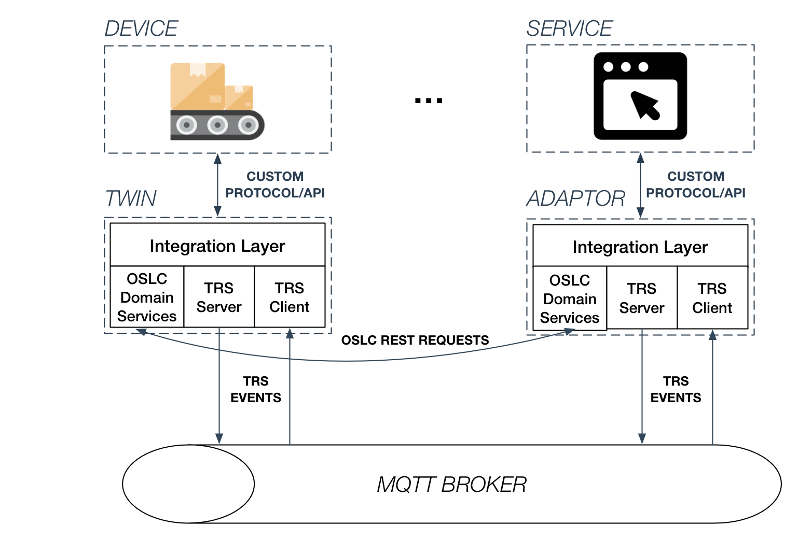
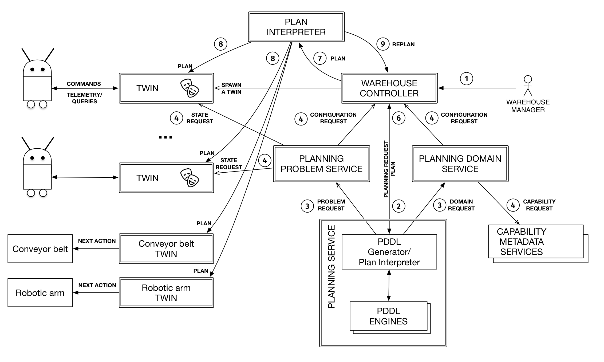

# Sandbox architecture

## Conceptual layering of the architecture

The _sandbox architecture_, which will be presented in the next section, builds
on top of the _reference architecture_. The reference architecture (see figure
above) is built around 2 layers: device/service layer and integration layer. The
former includes any kinds of services and devices that can use virtually any
kind of technology. The latter includes service adaptors and digital twins to
integrate the sandbox in a technology-agnotic way.

## Reference architecture

The digital twins and service adaptors are implemented as RESTful microservices.
[RDF](https://www.w3.org/TR/2014/NOTE-rdf11-primer-20140624/) is used to
represent and transfer knowledge between the microservices. OSLC
([primer](http://open-services.net/resources/tutorials/oslc-primer/), Jad's
lecture [part 1](https://www.youtube.com/watch?v=qQRZtd4EC7E) & [part
2](https://www.youtube.com/watch?v=k0cOAkEWvBs)) is used to avoid reinventing
the wheel around tool & service integration using RDF & REST. All entities are
represented as _OSLC (RDF) resources_. Each microservice contains a `Dockerfile`
that specifies all the Linux dependencies and configuration needed to run the
microservice in one ~~click~~ command.

When OSLC resources are changed (get created, modified, or deleted), _change
events_ are published via a _[TRS change
log](http://open-services.net/wiki/core/TrackedResourceSet-2.0/#Resource.3A-ChangeLog)_.
Our architecture will [extend TRS](trs-extensions.md) in a few ways in order to:

- publish change events in MQTT channels for implementing pubsub communication
  pattern
- allow change events to be strictly ordered (in order to preserve PDDL _action_
  ordering)
- allow multiple change events to be grouped in a _change event sequence_ (in
  order to allow PDDL _effects_ from a single action to affect multiple OSLC
  resource _atomically_)

More implementation details:

- microservices will be implemented using Java-based Lyo SDK or Prolog-based
  Leo's SDK :sunglasses:
- microservices shall run on Kubernetes
- MQTT broker is still to be chosen
-

## Warehouse UC architecture

The sandbox architecture is based on the reference architecture. Note that the
service/adaptor and device/twin boundary is only logical. For example, Planning
Service acts as an adaptor yet embeds a service inside the same Docker image.

Devices (robots [**TODO** link to the datasheets etc.]) run multiple ROS _nodes_
and are controlled by a single ROS _master_. MQTT node of the robot must registed an MQTT Last Will & Testament message that will be delivered to the twin when the robot loses MQTT connection to the broker. This will allow the twin to report robot status as down to the warehouse controller.

> I think a single master will conflict with the idea of a twin per device.

> If we have a single master, the architecture figure needs to be updated to
> reflect that.

The devices communicate with the rest of the sandbox through their _twins_. The
devices register in the sandbox through the _warehouse controller_ (there was an
idea to have a standalone _registration & discovery service_ to deal with the
proprietary discovery protocols by Leo, I think) and by reporting their
capabilities to the _capability metadata service_.

_Warehouse manager_ (or _MOO manager_) provides a concrete task to the
_warehouse controller_. _Warehouse controller_ allocates suitable devices and
other resources and creates a _planning request_ to the _planning service_.
Planning service requests a _planning problem_ and a _planning domain_ from the
corresponding services. Planning service translates the planning requests and
the gathered information to a PDDL file and runs the COTS planner. A newly
created plan is sent to the warehouse controller, which passes it to the _plan
interpreter_ and all involved adaptors/twins for execution.

_Plan interpreter_ controls the plan execution process and ensures that plan
exectution does not proceed until all effect from a previous effect have applied
successfully. Plan interpreter also determines if there is a need for
replanning.
