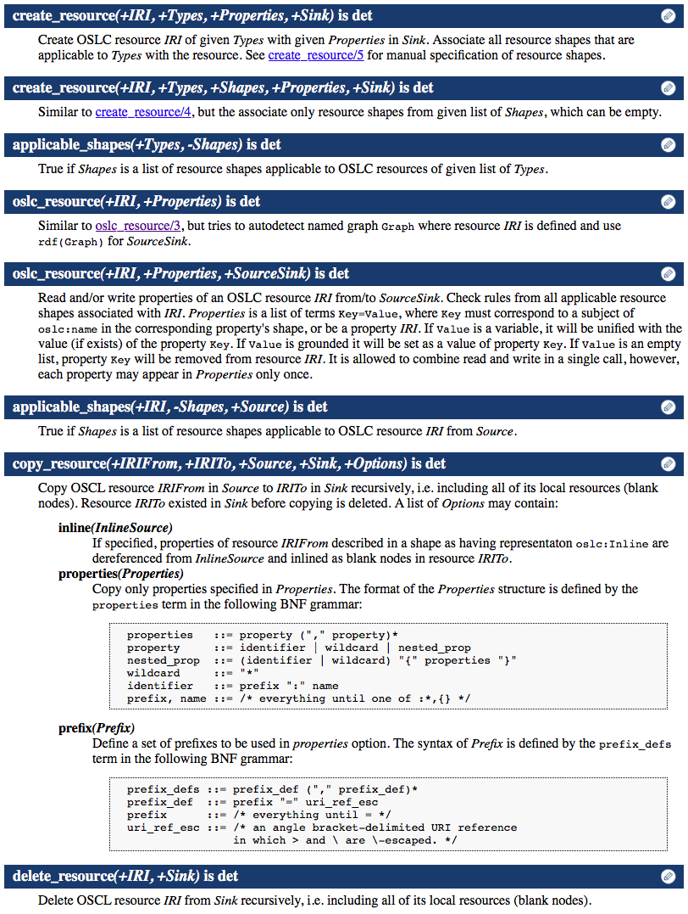

# OSLC prolog library

This is a CPACK library for Cliopatria, follows the standard structure. It has support for programmatic OSLC resource manipulation, and custom OSLC service definition (via declaring `oslc_*` handlers with priorities), basic REST resource operations (POST to creation factory, PUT with matching `If-Match` header, GET with `oslc.properties` and `oslc.prefix` parameters, and DELETE). Resource shape validation supports occurs and type checks. REST interface supports all RDF+XML and TURTLE content types on both input and output.

## Structure

The library consists of the following directories:

* `/rdf` contains the metadata.
* `/rdf/cpack` contains the CPACK metadata.
* `/rdf/base` contains data that will be preloaded with the cpack. Also contains a standard manifest ttl that defines how the preloading shall be done. In practice, this will load the `oslc` and `oslc_shape` graphs when this cpack is loaded.
* `/config-available` declares libraries to be loaded at the startup. We load both the libraries here as well as the application server.
* `/lib/` contains the library code itself.
* `/application` contains an OSLC core server and dispatching mechanism to custom handlers of REST requests towards OSLC resources.

## Library overview

Navigate to Help > Documentation > `oslc_prolog/lib` (in the dropdown). You will see the overview of all files and exported predicates. That should bring you to the API documentation at the following URI:

`http://localhost:3020/help/source/doc/_CWD_/cpack/oslc_prolog/lib/oslc.pl`

`Sink` is where all manipulated RDF resources are written to (`Source` is the opposite).

Most of the RDF calls are wrapped in a transaction.

## Usage

Current OSLC core implementation is a REST service that exposes OSLC resources at

`http://<host>:<port>/<prefix>/<resource>`

, where `<prefix>` is an IRI prefix defined in Prolog using `rdf_register_prefix/3` (or in Manifest.ttl file using `lib:Namespace` object), and `<resource>` is an OSLC local resource name. For example, a GET request to the following URI will return `rdf:type` resource:

`http://localhost:3020/rdf/type`

> Watch out for the weak warnings on the predicate overrides!
