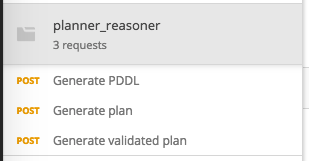
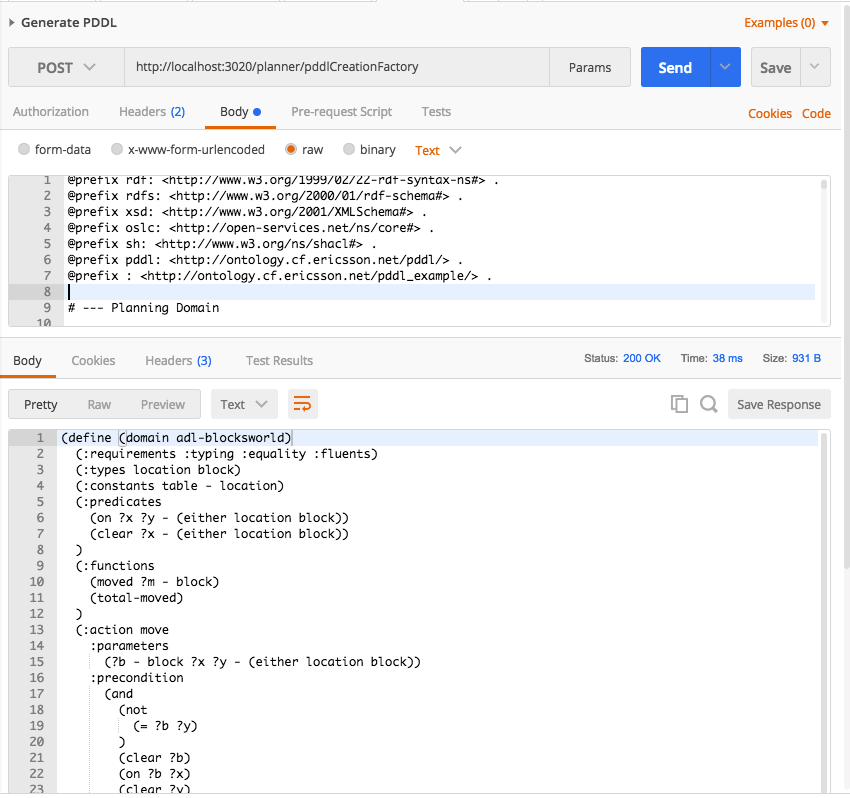

This project contains a PDDL generator, a Planner OSLC Service (based on Metric-FF planner and VAL validator).

## Getting started

To start the server, run inside current directory:

    $ docker-compose up

Now you can open http://localhost:3020/home

Next, install Postman and import `postman-collection.json`:

If you run the _Generate PDDL_ request, you should see the following response:

## Few design points:

* This document was used as a reference for a PDDL dialect:
  https://www.jair.org/media/1129/live-1129-2132-jair.pdf
* There are no variables per se. Variables only appear because they describe parameters of predicates, functions or actions. Hence, there is only `Parameter` class.
* Let's define terminology (using pseudo programming language):
  * `function myfunc(A: int, B:string) {...}` here **A** and **B** are **parameters**.
  * `int Y; X := myfunc(Y, "5")` here **Y** and **"5"** are **arguments**.
* Parameters are _orderable_ typed _properties_, i.e. if we have a bunch of parameters - their mutual order is important, they have an associated type, and they appear as properties (**predicates** in subject-**predicate**-object relation) of `Predicate`, `Function` or `Action`.
* Order of parameters is modelled using SHACL `order` property at the moment. There are at least two other ways of modelling the order:
  * Using `rdf:List`s and combination of `rdf:first`, `rdf:rest` properties
  * Using `rdf:Seq` and corresponding `rdf:_1`, `rdf_2`, ... properties
* There may be multiple usages of the same user-defined _type_, _predicate_, _function_ or _action_. Hence, they are _meta classes_, i.e. they are first subclassed by a **user** (to create corresponding definitions) and then subclasses are instantiated multiple times for usage (in case of types, instantiations are objects). In fact, `Action` is subclassed by a **user** and instantiated not by a **user**, but by a **PDDL Planner**. All other classes in the ontology are only instantiated (not subclassed).
* There is no need to model the order of arguments of `Predicate`, `Function` or `Action` because arguments are always bound to their corresponding parameters (which themselves are already ordered) by appearing as **objects** in the subject-predicate(parameter)-**object**(argument) relations.
* Arguments of built-in operators such as `>`, `imply`, `/`, etc. are also order sensitive. For them there are two properties defined: `pddl:left` and `pddl:right` that allow to specify left and right arguments respectively. For the order insensitive operators (such as `and`) the arguments are specified using `pddl:argument` property.
* OSCL shapes, unfortunately, do not allow to completely validate PDDL documents, however partial validation is possible by using `oslc:occurs` and `oslc:range` checks (it is not always possible to specify precise `oslc:range` types as some of them are user-defined, and inferencing over `rdfs:subClassOf` is not allowed in OSLC).

Here is the current PDDL ontology (see pddl.ttl):

## Endpoint reference

### Generate PDDL text

Base URI:  `http://<host>/planner/pddlCreationFactory`

Do `POST` with `Accept: text/x-pddl` header and body containing either `pddl:Domain`, `pddl:Problem` or `pddl:Plan` resources or any combination of them.

### Generate plan
Base URI:  `http://<host>/planner/planCreationFactory`

Do `POST` with `Accept: application/turtle` or `application/rdf+xml` header and body containing both `pddl:Domain` and `pddl:Problem` resources. The returned resource is of type `pddl:Plan` containing steps as resources of type `pddl:Step` ordered using `sh:order` property.

For plan generation Metric-FF planner binary `ff` should be where `run.pl` is or in `$PATH`.

### Generate validated plan
Base URI:  `http://<host>/planner/validatedPlanCreationFactory`

Do `POST` with `Accept: application/turtle` or `application/rdf+xml` header and body containing both `pddl:Domain` and `pddl:Problem` resources. The returned resource is of type `pddl:Plan` (as in the above case), each `pddl:Step` of which is annotated with `pddl:adding`, `pddl:removing`, `pddl:updating` properties.

For validated plan generation both Metric-FF planner binary `ff` and VAL binary `validate` should be where `run.pl` is or in `$PATH`.
